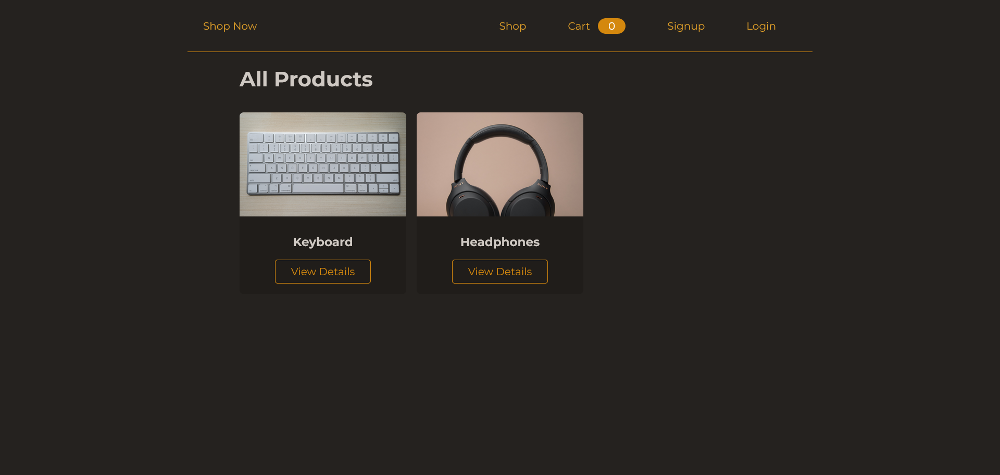

# Online shopping website with Admin Panel

## Screenshot

## Tech Stack
- HTML
- CSS 
- JavaScript
- Express.JS
- MongoDB
- EJS Template Engine
- Stripe API
- Git & Github

## Features

**User and Admin Views** : Simple signup and signin for both user types.  

#### User Features
- Browse and view all products
- Detailed product pages
- Easy shopping cart management
- Order tracking

#### Admin Features
- Admin dashboard for easy management
- Product management (add and update)
- Order overview for different users

**Security** : Protected routes and secure Stripe payments  
**Code Efficiency** : Organized using MVC architecture  
**Mobile-Friendly** : Designed for mobile devices  
**User-Friendly** : Hassle-free online shopping experienceTech   

*NOTE* : This application has not been deployed live yet (due to some technical issues), but you can check out its video overview on my LinkedIn account. I will be deploying it live soon as well.

You can reach out to me on linkedin, this is my profile [LinkedIn](https://www.linkedin.com/in/kapil-kharera-191b83245/)

*NOTE* : Please feel free to provide feedback on my work.
